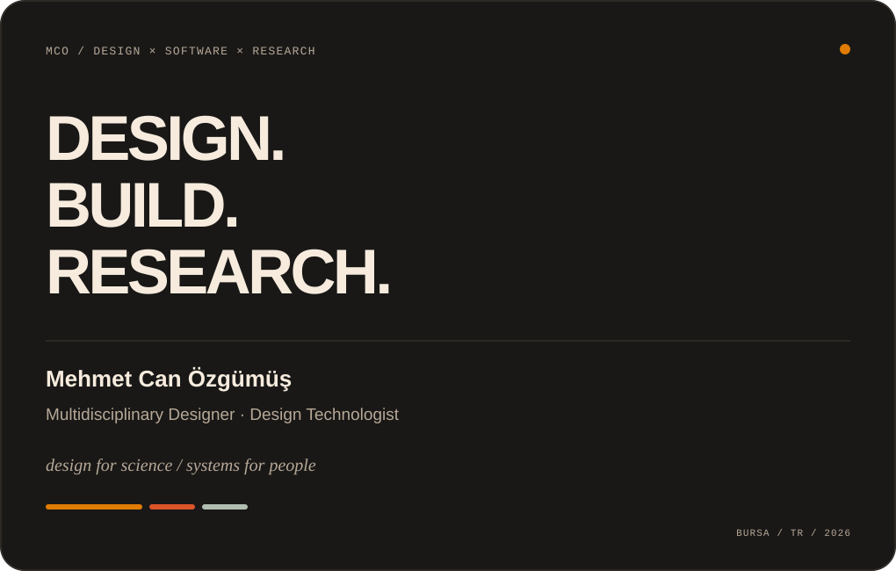
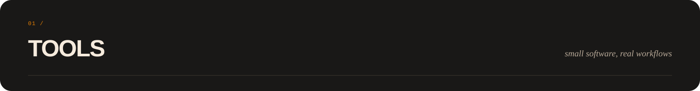
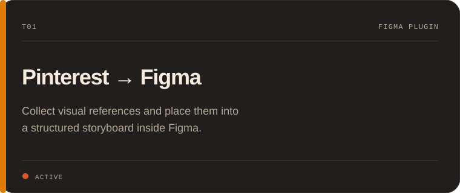
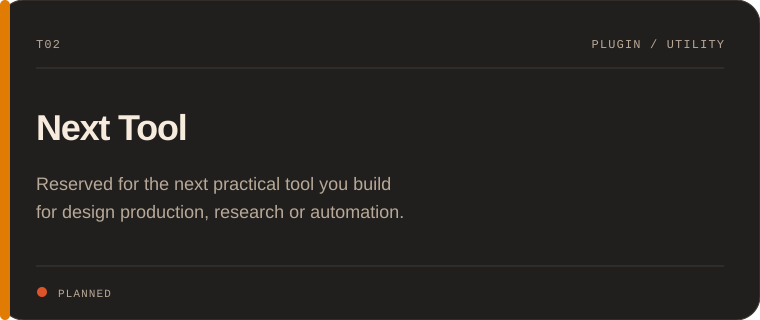
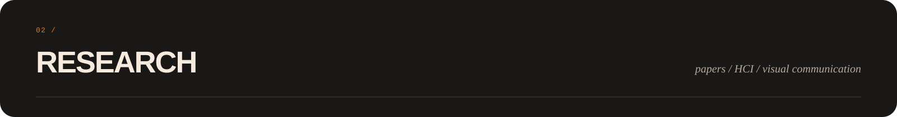
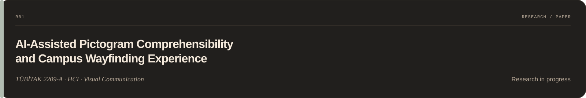
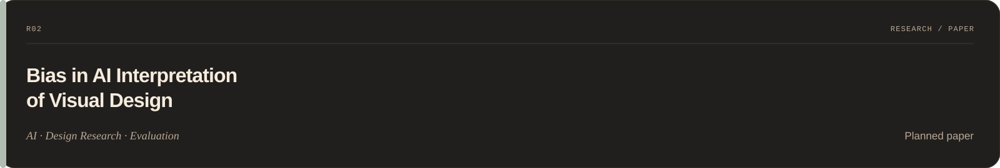
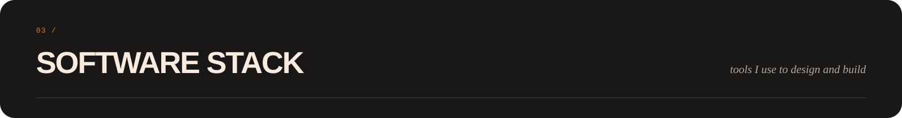
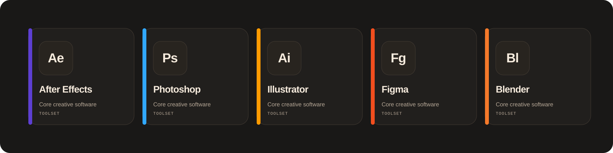
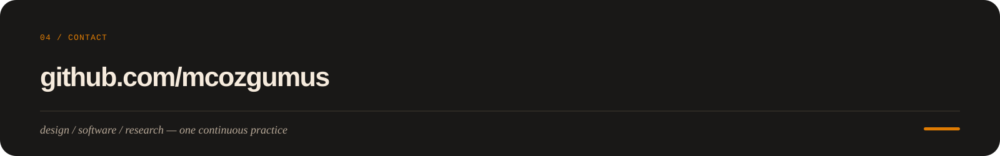

<!--
MCO — DESIGN FOR SCIENCE
Banner source:
https://i.hizliresim.com/jxrbrq2a.png
Profile source:
https://i.hizliresim.com/w0rinvle.png
-->

  

 

<table>
  <tr>
    <td width="33%" valign="top">
      
    </td>
    <td width="67%" valign="top">
      <picture>
        <source media="(prefers-color-scheme: dark)" srcset="./assets/identity-dark.svg">
        <source media="(prefers-color-scheme: light)" srcset="./assets/identity-light.svg">
        
      </picture>
    </td>
  </tr>
</table>

 

<picture>
  <source media="(prefers-color-scheme: dark)" srcset="./assets/tools-header-dark.svg">
  <source media="(prefers-color-scheme: light)" srcset="./assets/tools-header-light.svg">
  
</picture>

<table>
  <tr>
    <td width="50%" valign="top">
      <picture>
        <source media="(prefers-color-scheme: dark)" srcset="./assets/tool-pinterest-figma-dark.svg">
        <source media="(prefers-color-scheme: light)" srcset="./assets/tool-pinterest-figma-light.svg">
        
      </picture>
    </td>
    <td width="50%" valign="top">
      <picture>
        <source media="(prefers-color-scheme: dark)" srcset="./assets/tool-next-dark.svg">
        <source media="(prefers-color-scheme: light)" srcset="./assets/tool-next-light.svg">
        
      </picture>
    </td>
  </tr>
</table>

 

<picture>
  <source media="(prefers-color-scheme: dark)" srcset="./assets/research-header-dark.svg">
  <source media="(prefers-color-scheme: light)" srcset="./assets/research-header-light.svg">
  
</picture>

 

<picture>
  <source media="(prefers-color-scheme: dark)" srcset="./assets/paper-wayfinding-dark.svg">
  <source media="(prefers-color-scheme: light)" srcset="./assets/paper-wayfinding-light.svg">
  
</picture>

 

<picture>
  <source media="(prefers-color-scheme: dark)" srcset="./assets/paper-bias-dark.svg">
  <source media="(prefers-color-scheme: light)" srcset="./assets/paper-bias-light.svg">
  
</picture>

 

<picture>
  <source media="(prefers-color-scheme: dark)" srcset="./assets/software-header-dark.svg">
  <source media="(prefers-color-scheme: light)" srcset="./assets/software-header-light.svg">
  
</picture>

 

<picture>
  <source media="(prefers-color-scheme: dark)" srcset="./assets/software-stack-dark.svg">
  <source media="(prefers-color-scheme: light)" srcset="./assets/software-stack-light.svg">
  
</picture>

 

<a href="https://github.com/mcozgumus">
  <picture>
    <source media="(prefers-color-scheme: dark)" srcset="./assets/footer-darkv2.svg">
    <source media="(prefers-color-scheme: light)" srcset="./assets/footer-lightv2.svg">
    
  </picture>
</a>
